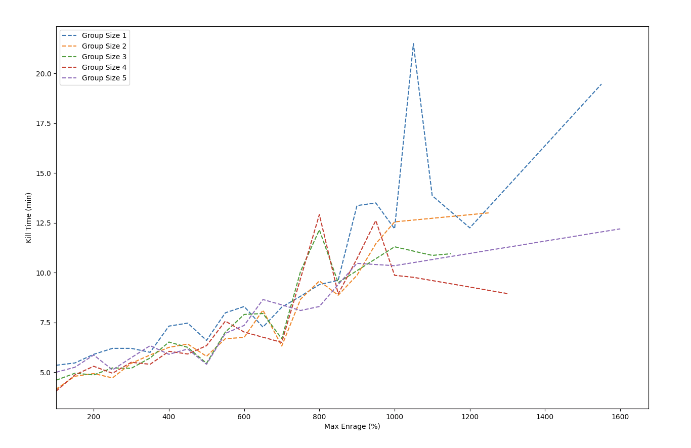

# zamorak-hiscores-scraper
Python scripts to scrape the Zamorak Boss Hiscores (at https://rs.runescape.com/hiscores/bosses) in various ways, returning both the raw data and a graph

Was used shortly after the release of the boss/hiscores, when the hiscores were not so populated or laggy. If used now, it may take a long time to scrape, due to how slowly the requests from the website now take.

## Example hiscore scrape from 14 July 2022 - showing the _fastest_ killtimes per enrage, at each enrage bracket

